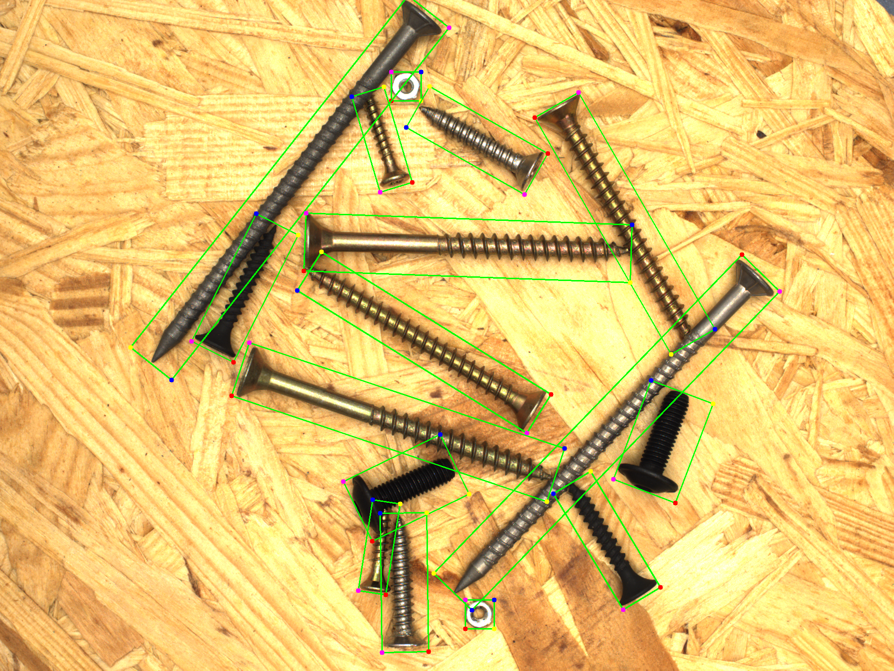
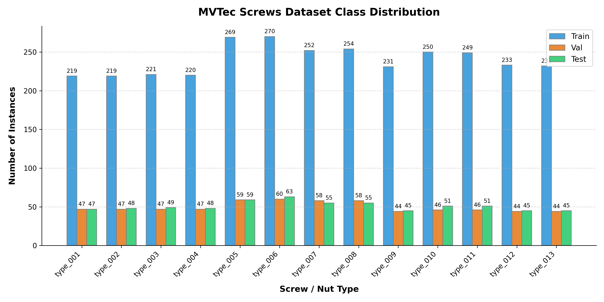
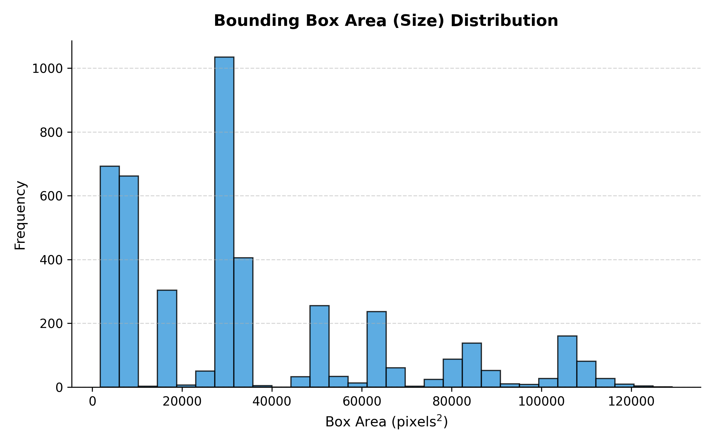
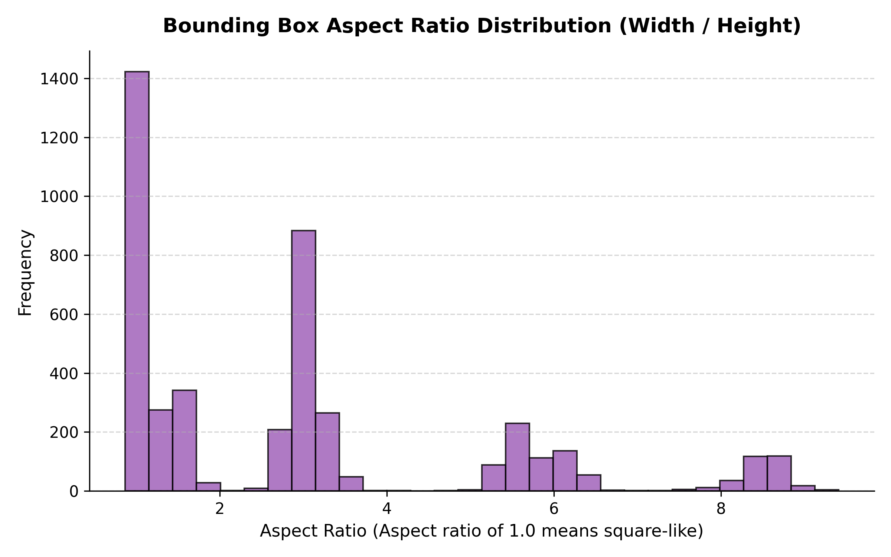
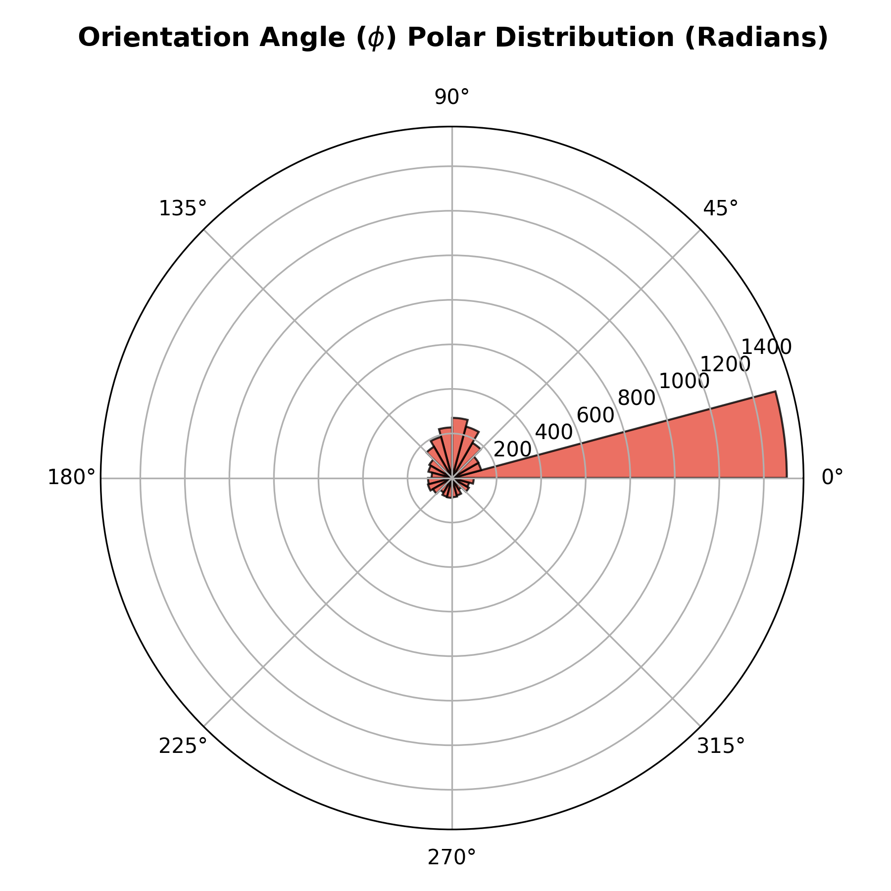
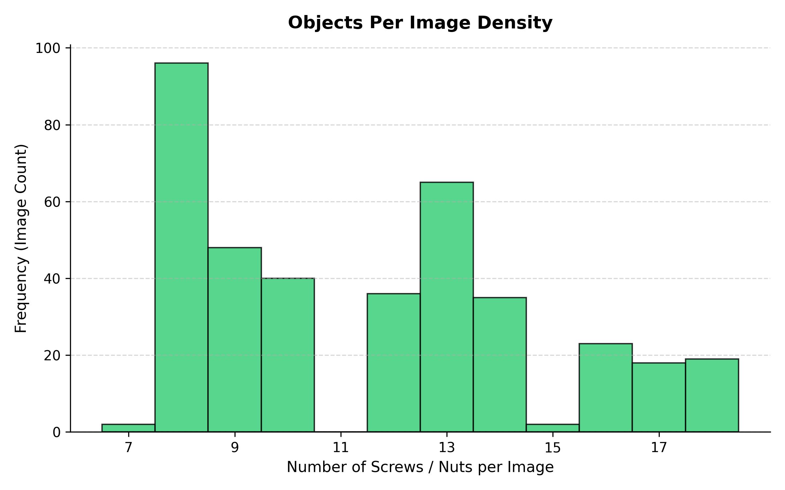
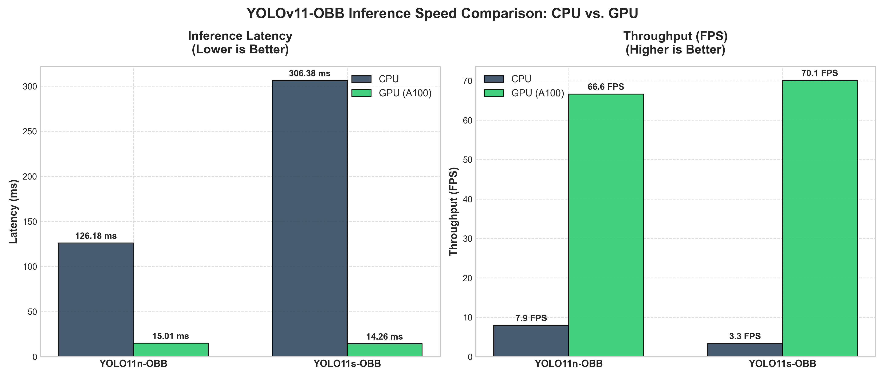

# YOLOv11-OBB Screws QA: Oriented Object Detection & Robotic Grasp Alignment



<div align="center">

[](https://github.com/ultralytics/ultralytics)
[](https://streamlit.io/)
[](https://pytorch.org/)
[](https://onnx.ai/)
[](#license)
[](https://www.linkedin.com/in/avaz-asgarov)

</div>

---

## 1. Project Background & Objective

In industrial manufacturing, quality assurance (QA) and robotic pick-and-place systems require precise object localization. Standard horizontal bounding boxes represent objects as axis-aligned rectangles:

$$B_{h} = [x_c, y_c, w, h]$$

This representation fails for tilted, elongated, or overlapping parts (like screws, nuts, and bolts). Horizontal boxes introduce significant background noise and overlap heavily with neighboring items, making it impossible to determine the exact tilt angle. 

This project implements **Oriented Bounding Boxes (OBB)**:

$$B_{obb} = [x_c, y_c, w, h, \theta]$$

where $\theta \in [-\pi/4, 3\pi/4]$ represents the rotation angle of the object. Predicting the orientation angle allows robotic arms to rotate their grippers to align with the screw's major axis, ensuring a clean grip without damaging the parts.

---

## 2. Dataset & Exploratory Data Analysis (EDA)

The model is trained on the preprocessed [MVTec Screws Dataset](https://www.mvtec.com/research-teaching/datasets/mvtec-screws), consisting of 384 images containing a total of **4,427 labeled targets** of various industrial screws and nuts lying at arbitrary orientations on a wooden surface.

An advanced, fast in-memory EDA pipeline ([scripts/analyze_dataset.py](scripts/analyze_dataset.py)) was developed to inspect annotations prior to training, producing five statistical plots:

### A. Class Distribution

*   **Analysis:** Shows the frequency of the 13 different screw/nut categories. The dataset is exceptionally well-balanced across all classes. The instance counts range tightly between **313** (Class 0) and **393** (Class 5), yielding a maximum-to-minimum class ratio of only $1.25:1$. This balanced distribution ensures that the model trains evenly across all categories without suffering from minority-class starvation, eliminating the need for class-weighted loss modifications or custom sampling.

### B. Bounding Box Area Distribution

*   **Analysis:** Reveals a wide scale variance representing the physical size difference between small washers/nuts and long screws. Bounding box areas span from a tiny **680.75 px²** to a massive **50,980.90 px²** (a 75x scale ratio), with a median of **11,291.85 px²**. At 1024x1024 resolution, the smallest objects (680 px²) are only about $26 \times 26$ pixels. Lowering the input resolution to 512x512 would shrink these objects to a mere $13 \times 13$ pixels, rendering them virtually undetectable for standard feature maps. This mathematically justifies our decision to train at the full **1024x1024px** resolution.

### C. Aspect Ratio Distribution (Width / Height)

*   **Analysis:** Computes the ratio of the long side to the short side. Aspect ratios range from **1.00** (symmetric nuts/washers) up to **12.33** (extremely long fasteners), with a mean of **3.12** and median of **2.33**. A median of 2.33 and mean of 3.12 proves that the majority of components are highly elongated screws. Standard horizontal bounding boxes on objects with aspect ratios $> 3$ contain massive background areas (up to 70-80% noise) and overlap heavily. Using OBB isolates these elongated targets cleanly, minimizing false overlap detections and allowing exact orientation estimation.

### D. Rotation Angle Distribution (Polar Histogram)

*   **Analysis:** Displays the angular distribution of targets. Orientation angles cover the full range from **$-\pi$ (-3.14)** to **$+\pi$ (+3.14)** radians. The polar plot shows an even angular distribution across the entire 360-degree range. The only major spike is at 0 radians, representing the symmetric circular nuts which default to 0 orientation in the annotations. The screws are distributed uniformly in all directions, confirming the model must learn to predict rotation invariant features across the full circle.

### E. Object Density per Image

*   **Analysis:** Analyzes the target count per scene. Images contain between **7** and **18** objects, with a mean of **11.53** and median of **12.00**. This narrow density distribution ensures a stable target density across batches. This prevents GPU batch padding inefficiencies during training and ensures that non-maximum suppression (NMS) thresholds remain consistent across the dataset.

---

## 3. Preprocessing Pipeline

The preprocessing pipeline ([scripts/prepare_dataset.py](scripts/prepare_dataset.py)) handles the following operations:

### 1. Coordinate Transformation
The raw MVTec Screws dataset stores oriented bounding boxes in COCO format as:
$$B_{raw} = [y_c, x_c, w, h, \phi]$$
where $(x_c, y_c)$ represents the center, $(w, h)$ represents the bounding dimensions, and $\phi \in [-\pi, \pi]$ represents the rotation angle. 

YOLOv11-OBB requires oriented bounding boxes represented as the normalized 4-corner coordinate sequence:
$$[x_1, y_1, x_2, y_2, x_3, y_3, x_4, y_4]$$
To transform the bounding parameters, unit rotation vectors along the width and height directions are computed:
$$u_x = (\cos\phi, \sin\phi)$$
$$u_y = (-\sin\phi, \cos\phi)$$
The 4 rotated corner coordinates (in pixels) are then calculated using vector offsets:
$$p_1 = (x_c - \frac{w}{2}u_x - \frac{h}{2}u_y)$$
$$p_2 = (x_c + \frac{w}{2}u_x - \frac{h}{2}u_y)$$
$$p_3 = (x_c + \frac{w}{2}u_x + \frac{h}{2}u_y)$$
$$p_4 = (x_c - \frac{w}{2}u_x + \frac{h}{2}u_y)$$
Finally, the corners are normalized by dividing the $x$-coordinates by image width ($1024$) and $y$-coordinates by image height ($1024$), and saved in the YOLO label format:
`<class_idx> x1 y1 x2 y2 x3 y3 x4 y4`

### 2. Dataset Partitioning
The dataset is partitioned into standard training, validation, and test splits following the official MVTec Screws split lists (384 total images):
*   **Training Set:** 274 images (**71.3%**)
*   **Validation Set:** 55 images (**14.3%**)
*   **Test Set:** 55 images (**14.3%**)

### 3. Sanity Checks & Visualizations
To verify coordinate transformation accuracy, the pipeline automatically draws the calculated oriented bounding boxes on sample images. The outputs are saved in [dataset/sanity_checks/](dataset/sanity_checks/). Below is a sample sanity check visualization:


### 4. YOLO Dataset YAML Configuration
The pipeline generates the training configuration file [dataset/data.yaml](dataset/data.yaml), defined as follows:
```yaml
path: dataset
train: images/train
val: images/val
test: images/test

names:
  0: type_001
  1: type_002
  2: type_003
  3: type_004
  4: type_005
  5: type_006
  6: type_007
  7: type_008
  8: type_009
  9: type_010
  10: type_011
  11: type_012
  12: type_013
```

---

## 4. Model Training & Optimization

Training was performed on an **NVIDIA A100-SXM4-80GB GPU** inside a Google Colab Pro+ environment. The pipeline consists of two phases:

### Phase 1: Baseline Training (50 Epochs)
*   Baseline models of **YOLOv11n-OBB** (Nano) and **YOLOv11s-OBB** (Small) were trained at `imgsz=1024` with default parameters to establish a performance baseline.

### Phase 2: Genetic Hyperparameter Tuning (15 Iterations)
*   A genetic evolutionary search (`model.tune()`) was run for 15 iterations of 10 epochs each using the Nano model.
*   The tuner mutated augmentation and regularization parameters to find the optimal configuration. The best fitness score of `0.49173` was achieved at iteration 7, showing the following optimized parameters:
    *   `weight_decay`: `0.00034` (regularization to prevent overfitting)
    *   `mosaic`: `0.9287` (92.8% probability of multi-image combination)
    *   `scale`: `0.50521` (50% random scaling)
    *   `translate`: `0.13523` (translation augmentation range)
*   Using these best parameters, the final models were trained for **100 epochs** at `imgsz=1024`.

---

## 5. Performance & Benchmarking Results

The final optimized models were evaluated on the independent test split.

### Overall Performance Comparison (Test Split)

| Model | Variant | Epochs | Input Size | Precision | Recall | mAP50 | mAP50-95 |
| :--- | :--- | :--- | :--- | :--- | :--- | :--- | :--- |
| **YOLOv11n-OBB** (Nano) | Baseline | 50 | 1024 | 99.0% | 98.6% | 99.1% | 93.2% |
| **YOLOv11n-OBB** (Nano) | Optimized (Tuned) | 100 | 1024 | 98.7% | 99.1% | **99.4%** | 94.1% |
| **YOLOv11s-OBB** (Small) | Baseline | 50 | 1024 | 99.2% | **99.5%** | 99.2% | 94.5% |
| **YOLOv11s-OBB** (Small) | Optimized (Tuned) | 100 | 1024 | **99.5%** | 99.4% | 99.2% | **95.4%** |

*Note: Due to memory limits at batch=128 for the Small model, the YOLOv11 engine automatically halved the batch size to 64 and retried, completing training successfully at the full 1024 image resolution.*

### Real-Time Inference Speed Benchmark (1024x1024 px)

| Model | Device | Preprocessing | Inference | Postprocessing | Total Latency | Throughput |
| :--- | :--- | :--- | :--- | :--- | :--- | :--- |
| **YOLOv11n-OBB** (Nano) | CPU | 7.30 ms | 126.18 ms | 24.10 ms | 157.58 ms | 6.3 FPS |
| **YOLOv11n-OBB** (Nano) | GPU (A100) | **0.20 ms** | 15.01 ms | **1.90 ms** | 17.11 ms | 58.4 FPS |
| **YOLOv11s-OBB** (Small) | CPU | 7.30 ms | 306.38 ms | 24.10 ms | 337.78 ms | 2.9 FPS |
| **YOLOv11s-OBB** (Small) | GPU (A100) | **0.20 ms** | **14.26 ms** | 2.00 ms | **16.46 ms** | **60.7 FPS** |



---

## 6. Model Explainability (xAI)

To verify the decision-making process of the network, a PyTorch forward hook was registered on the **SPPF (Spatial Pyramid Pooling Fast)** layer. In the YOLOv11 backbone architecture, Layer 9 corresponds to this final pooling bottleneck layer before the neck/head:


### Analysis:
*   The SPPF layer is the bottleneck where high-level spatial features are pooled at multiple scales.
*   The channel-averaged activation overlay shows that the model focuses intensely on the **thread intervals and head boundaries** of the screws, rather than the background. This confirms the model uses the physical geometry of the fastener to estimate classification type and orientation angle.

---

## 7. Streamlit Web Dashboard Architecture

The dashboard ([app.py](app.py)) is structured modularly to separate concern layers:
*   **[src/utils.py](src/utils.py):** Automatic CPU/GPU device selection and cached model loading (`@st.cache_resource`).
*   **[src/drawing.py](src/drawing.py):** Rotated bounding box polygon rendering and double-pass high-contrast orientation vector arrows (black outline with white core for visibility).
*   **[src/tabs.py](src/tabs.py):** Implements the four views:
    1.  **Single Image Analyzer:** Process single images, showing coordinates, rotation angles, and zoomed cropped previews of selected parts.
    2.  **Side-by-Side Comparison:** Compare live prediction overlays, latencies, and object counts of two different models simultaneously.
    3.  **Batch Processor:** Upload multiple images, run batch predictions in a gallery grid, and export consolidated detection tables as a CSV.
    4.  **Benchmarks Report:** Render static training results, loss curves, confusion matrices, and speed charts.

---

## 8. Project Structure

```
surup classification/
├── app.py                                                          # Streamlit Web Dashboard (App Entry Point)
├── README.md                                                       # Complete Project Documentation & Showcase
├── requirements.txt                                                # Python Dependencies List for Local Setup
├── LICENSE                                                         # MIT License File
├── .gitignore                                                      # Prevents raw dataset & large weights from Git tracking
│
├── src/                                                            # Modular Source Code for Streamlit App
│   ├── utils.py                                                    # Device detection & cached model loading utilities
│   ├── drawing.py                                                  # High-contrast OBB & orientation vector drawing
│   └── tabs.py                                                     # UI logic for single, comparison, batch & report tabs
│
├── scripts/                                                        # Dataset Pipeline & EDA Python Scripts
│   ├── prepare_dataset.py                                          # Data extraction, OBB coordinate math & partitioning
│   ├── analyze_dataset.py                                          # Fast in-memory tar.gz parsing & EDA plotter
│   └── plot_benchmark.py                                           # Matplotlib grouped bar-chart generator for latency
│
├── notebooks/                                                      # Google Colab Training Notebooks
│   └── mvtec_screws_training.ipynb                                 # End-to-end YOLOv11 OBB training & tuning notebook
│
├── models/                                                         # Trained Model Weights (PyTorch & ONNX Formats)
│   ├── yolo11n_baseline.pt                                         # Baseline Nano model weights (50 epochs)
│   ├── yolo11n_optimized.onnx                                      # Tuned & optimized Nano model (ONNX format)
│   ├── yolo11n_optimized.pt                                        # Tuned & optimized Nano model weights (100 epochs)
│   ├── yolo11s_baseline.pt                                         # Baseline Small model weights (50 epochs)
│   ├── yolo11s_optimized.onnx                                      # Tuned & optimized Small model (ONNX format)
│   └── yolo11s_optimized.pt                                        # Tuned & optimized Small model weights (100 epochs)
│
└── results/                                                        # Evaluation Reports & Static Plot Assets
    ├── performance_report.md                                       # Comprehensive evaluation and comparison details
    ├── best_hyperparameters.yaml                                   # Tuned config discovered via genetic search
    ├── class_distribution.png                                      # EDA Plot: Class distribution bar chart
    ├── box_area_distribution.png                                   # EDA Plot: Object bounding box areas
    ├── aspect_ratio_distribution.png                               # EDA Plot: Bounding box aspect ratios (W/H)
    ├── orientation_distribution.png                                # EDA Plot: Polar histogram of object angles
    ├── objects_per_image.png                                       # EDA Plot: Density histogram of target counts
    └── plots/                                                      # Training history curves and validation figures
        ├── results_gradcam.png                                     # xAI Map: SPPF activation overlay on test image
        ├── inference_speed_benchmark.png                           # Grouped bar chart comparing CPU vs GPU latency
        ├── yolo11s_optimized_results.png                           # Training loss & validation mAP curves
        └── yolo11s_optimized_confusion_matrix_normalized.png       # Normalized confusion matrix plot
```

---

## 9. Getting Started

### 1. Clone the Repository
```bash
git clone https://github.com/AvazAsgarov/yolov11-obb-screws-qa.git
cd yolo-obb-screws
```

### 2. Install Dependencies
```bash
pip install -r requirements.txt
```

### 3. Launch the Web Dashboard
```bash
streamlit run app.py
```

---

## 10. License

This project is licensed under the MIT License - see the [LICENSE](LICENSE) details.

---

## 11. Author

**Avaz Asgarov**
*   LinkedIn: [Avaz Asgarov](https://www.linkedin.com/in/avaz-asgarov)
*   Project: YOLOv11-OBB Screws QA Quality Inspection Pipeline
